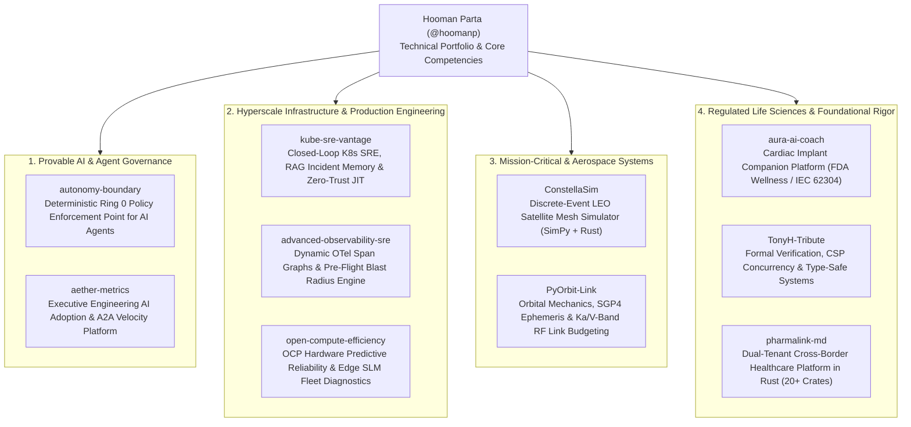

# Hooman Parta ⚡
### Engineering Leader & Principal Systems Architect
**Provable AI Governance • Hyperscale SRE & Infrastructure • Mission-Critical Systems • Regulated Platforms**

---

## 🧭 Executive Summary & Operating Philosophy

With 25+ years architecting distributed systems, cloud platforms, and security boundaries at Fortune-100 and hyperscale engineering scope, I build systems that operate at the intersection of **autonomous intelligence, high-reliability infrastructure, and provable regulatory compliance**.

> *"Systems that act must be provably bounded; systems that scale must be autonomously resilient; and systems that govern must be mathematically auditable."*

My work spans from formal verification and deterministic "Ring 0" governance kernels for AI agents to hyperscale production engineering (telemetry-driven blast-radius mitigation, hardware auto-remediation) and mission-critical communications (LEO satellite meshes and implantable cardiac medical platforms).

---

## 🏛️ Flagship Engineering Portfolio

---

## 🔬 Featured Reference Implementations

### 1. Provable AI & Autonomous Agent Governance

* **[autonomy-boundary](https://github.com/hoomanp/autonomy-boundary)** — *The Autonomy Boundary Framework (ABF)*  
  The deterministic Policy Enforcement Point (PEP) and tamper-evident custody plane for autonomous AI agents. Delivers sub-millisecond (`< 0.85 ms`), zero-LLM action verification, neutralizing real-world agent vulnerability classes (SymJack approval divergence, DSEWiki scope gaps, state drift) across all 8 **OWASP Agentic Security Initiative (ASI)** categories. Includes native **Anthropic Model Context Protocol (MCP)** gateway enforcement.
* **[aether-metrics](https://github.com/hoomanp/aether-metrics)** — *Engineering AI Governance & Autonomous Velocity Platform*  
  Executive control plane measuring enterprise AI developer adoption, token-to-value efficiency, and DORA cycle time deltas. Features an **Agent-to-Agent (A2A) negotiation protocol** that autonomously detects test coverage deficits and dispatches specialized subagents to synthesize unit tests before pull requests merge.

### 2. Hyperscale Production Engineering & Reliability

* **[kube-sre-vantage](https://github.com/hoomanp/kube-sre-vantage)** — *Autonomous Kubernetes SRE & Zero-Trust Control Plane*  
  Closed-loop reliability engine across AKS, EKS, and GKE. Ingests normalized OpenTelemetry metrics, grounds incident reasoning in ChromaDB vector memory, calculates multi-window OpenSLO burn rates, and enforces **Google Staff Security-aligned Zero-Trust Just-In-Time (JIT) access** on all automated cluster remediations.
* **[advanced-observability-sre](https://github.com/hoomanp/advanced-observability-sre)** — *Service-Centric SLO Dependency & Blast Radius Engine*  
  Hyperscale SRE reference architecture (Meta PE / Google SRE aligned) utilizing OpenTelemetry span links to dynamically map microservice dependency multigraphs. Simulates pre-flight blast radius in continuous delivery pipelines and enforces automated **Stop-Ship** rollout halts when downstream error budgets are threatened.
* **[open-compute-efficiency](https://github.com/hoomanp/open-compute-efficiency)** — *Predictive Hardware Reliability & Fleet Health Control Plane*  
  Treats data center hardware as a software reliability problem. Scrapes OpenBMC Redfish telemetry on Open Compute Project (OCP) server chassis, runs edge-quantized Small Language Models (SLMs) on rack controllers to predict component failures (PCIe AER, DRAM correctable errors), and automates node cordoning and FRU ticket dispatch.

### 3. Mission-Critical & Aerospace Telecommunications

* **[ConstellaSim](https://github.com/hoomanp/ConstellaSim)** — *LEO Satellite Network Topology & Discrete-Event Simulator*  
  Advanced discrete-event simulator modeling packet-level routing across dynamic Low Earth Orbit (LEO) mega-constellations (Amazon Project Kuiper / Starlink). Combines SimPy, NetworkX, and a high-performance **Rust event core (`constella-core-rs`)** with a multi-cloud RAG mission analyst streamed via Server-Sent Events (SSE).
* **[PyOrbit-Link](https://github.com/hoomanp/PyOrbit-Link)** — *LEO Satellite Ephemeris Tracker & RF Link Budget Platform*  
  Aerospace systems toolkit integrating CelesTrak NORAD TLE ingestion, high-precision Skyfield SGP4 orbit propagation, relativistic Doppler shift tracking ($\pm 65\text{ kHz}$ at Ka-band), and ITU-R P.618 atmospheric and rain fade link budgeting.

### 4. Regulated Life Sciences & Foundational Rigor

* **[aura-ai-coach](https://github.com/hoomanp/aura-ai-coach)** — *Cardiovascular CRM Implant Mobile Companion Platform*  
  Enterprise digital health reference architecture bridging Abbott® CRM cardiac telemetry with consumer health ecosystems (Apple HealthKit & Google Health Connect). Enforces strict **FDA FD&C Act §520(o)** general wellness boundaries, IEC 62304 Class A/B lifecycle decoupling, and zero-trust ephemeral memory.
* **[TonyH-Tribute](https://github.com/hoomanp/TonyH-Tribute)** — *Foundations of Correctness: Quicksort, Hoare Logic, CSP & Type Safety*  
  A technical monograph connecting Sir Tony Hoare's seminal breakthroughs in formal verification and communicating sequential processes directly to modern distributed AI systems, actor runtimes, and algebraic type safety.
* **[pharmalink-md](https://github.com/hoomanp/pharmalink-md)** — *Dual-Product Healthcare Distribution Engine*  
  Monorepo of 20+ Rust crates powering cross-border prescription routing, clinical equivalence (DIN $\leftrightarrow$ NDC), and multi-tenant pharmacy delivery dispatch, defensible against HIPAA, PIPEDA, and Quebec Law 25 audits.

---

## ⚡ Technical Competencies & Leadership Scope

| Leadership & Systems Dimension | Core Technologies & Methodologies |
| :--- | :--- |
| **Engineering Leadership & Strategy** | Executive Technology Strategy, DORA Metrics & Engineering ROI, Team Mentorship & Organization Scaling, Capital Allocation, Cross-Functional Executive Alignment. |
| **Provable AI & Agent Governance** | Deterministic Policy Enforcement (ABF), Anthropic Model Context Protocol (MCP), OWASP Top 10 for Agentic Applications, RAG Pipelines, SLM Edge Diagnostics. |
| **Cloud Infrastructure & SRE** | OpenTelemetry (OTel), Kubernetes (EKS, AKS, GKE), Multi-Window Error Budgeting (OpenSLO), Distributed Tracing, Chaos Engineering, Automated Rollback Gating. |
| **Aerospace & Mission-Critical** | Discrete-Event Simulation (SimPy), SGP4 Orbit Mechanics, LEO Constellation Routing, Ka/V-Band RF Link Budgets, ITU-R P.618 Propagation. |
| **Security, Compliance & Privacy** | **CISSP Certified**, Zero-Trust Architecture (JIT Access), HIPAA Security Rule, FDA 21 CFR Part 11, PIPEDA, Quebec Law 25, SOC2 Type II Audit Readiness. |
| **Languages & Systems Programming** | **Rust** (Axum, Tokio, SQLx), **Python** (FastAPI, SimPy, Skyfield), **Go**, **TypeScript** (React Native, Next.js), SQL (Postgres 16, ClickHouse), C++. |

---

## 📬 Connect & Collaborate

- **LinkedIn:** [linkedin.com/in/hooman-parta](https://www.linkedin.com/in/hooman-parta)
- **GitHub:** [github.com/hoomanp](https://github.com/hoomanp)
- **Location:** Los Angeles, CA / Remote (Global Scope)
