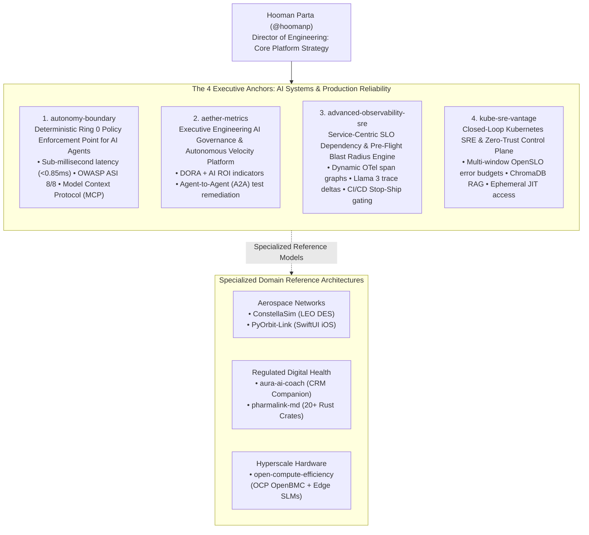

# Hooman Parta ⚡
### Director of Engineering | AI Systems, Hyperscale Infrastructure & Platform Reliability
**Provable AI Governance • Closed-Loop SRE • Autonomous Multi-Agent Platforms • Enterprise Scale**

---

## 🧭 Executive Summary & Leadership Thesis

With 25+ years architecting distributed systems, cloud platforms, and security boundaries at Fortune-100 and hyperscale engineering scope, I build and lead engineering organizations operating at the nexus of **autonomous AI systems, high-reliability cloud infrastructure, and provable regulatory compliance**.

> *"Systems that act must be provably bounded; systems that scale must be autonomously resilient; and engineering organizations that adopt AI must be quantitatively governed against technical debt."*

My work centers on establishing formal architectural governance for AI systems (deterministic "Ring 0" authorization kernels, sub-millisecond safety gating), closed-loop production engineering (OpenTelemetry distributed tracing, blast-radius mitigation, Zero-Trust JIT remediation), and scaling high-velocity engineering organizations with automated DORA telemetry.

---

### 📊 Executive Metrics & Engineering Benchmarks

| Strategic Domain | Quantitative Benchmark | Operational Invariant & Production Architecture |
| :--- | :--- | :--- |
| **Provable AI Governance Latency** | **`< 0.85 ms`** | Deterministic SHA-256 PEP execution in [`autonomy-boundary`](https://github.com/hoomanp/autonomy-boundary) (zero LLM in critical path) |
| **Agentic Security Coverage** | **`100% (8/8)`** | Full mitigation of OWASP Agentic Security Initiative (ASI-1 to ASI-8) vulnerability classes |
| **Organizational Velocity** | **`-24.8% Cycle Time`** | Closed-loop DORA + AI ROI governance with autonomous A2A quality gating in [`aether-metrics`](https://github.com/hoomanp/aether-metrics) |
| **Hyperscale Reliability Gating** | **`Stop-Ship on BRI`** | Pre-flight Blast Radius Index simulation halting canary rollouts before Tier-0 error budget exhaustion |
| **Zero-Trust Remediations** | **`Ephemeral JIT Tokens`** | Automated Kubernetes remediation with scoped 60s tokens in [`kube-sre-vantage`](https://github.com/hoomanp/kube-sre-vantage) |
| **Mission-Critical Test Rigor** | **`130 / 130 Passing`** | 21/21 suites, 96% service coverage in [`aura-ai-coach`](https://github.com/hoomanp/aura-ai-coach) CRM companion platform |

---

## 🏛️ Executive Architecture: The 4 Core Platform Pillars

---

## 🔬 The 4 Primary Executive Flagships

### 1. [autonomy-boundary](https://github.com/hoomanp/autonomy-boundary) — *The Autonomy Boundary Framework (ABF)*
* **Executive Problem:** Enterprisewide deployment of autonomous AI agents introduces catastrophic execution risks: agents mutating databases, executing code, and triggering payments based on probabilistic models that can hallucinate, suffer from prompt injection, or drift from approved human intent.
* **Architectural Solution:** Operates as **Ring 0 for AI Agents**—a deterministic, sub-millisecond (`< 0.85 ms`), zero-LLM Policy Enforcement Point (PEP) and tamper-evident custody plane. Neutralizes real-world agent vulnerability classes (SymJack approval divergence, DSEWiki scope gaps, state drift) across all 8 **OWASP Agentic Security Initiative (ASI)** categories. Includes native **Anthropic Model Context Protocol (MCP)** gateway enforcement.

### 2. [aether-metrics](https://github.com/hoomanp/aether-metrics) — *Engineering AI Governance & Autonomous Velocity Platform*
* **Executive Problem:** Engineering leadership lacks visibility into whether generative AI coding assistants (Copilot, Cursor) are driving genuine productivity or generating technical debt and review bottlenecks.
* **Architectural Solution:** An executive telemetry platform tracking **DORA + AI ROI indicators** (Cycle Time Delta, Token-to-Value efficiency, defect escape vs. AI attribution). Features an **Agent-to-Agent (A2A) JSON-RPC orchestration runtime** where Aether detects test coverage deficits on active pull requests and autonomously tasks external subagents to synthesize unit tests before code merges.

### 3. [advanced-observability-sre](https://github.com/hoomanp/advanced-observability-sre) — *Service-Centric SLO Dependency & Blast Radius Engine*
* **Executive Problem:** At hyperscale microservice density, low-level service degradation cascades non-linearly, causing sudden brownouts in Tier-0 customer-facing endpoints.
* **Architectural Solution:** A **Meta PE / Google SRE-aligned** observability framework using OpenTelemetry span links and context propagation to dynamically reconstruct real-time service dependency multigraphs. Computes a mathematical **Blast Radius Index ($BRI$)** within canary continuous deployment pipelines, enforcing automated **Stop-Ship halts** when predicted degradation exceeds remaining error budgets.

### 4. [kube-sre-vantage](https://github.com/hoomanp/kube-sre-vantage) — *Closed-Loop Kubernetes SRE & Zero-Trust Control Plane*
* **Executive Problem:** Static threshold alerting causes severe cognitive fatigue, while automated remediation scripts often hold persistent cluster-admin permissions, violating SOC2/ISO compliance.
* **Architectural Solution:** A closed-loop reliability engine across AKS, EKS, and GKE. Normalizes telemetry via OpenTelemetry, contextualizes anomalies using ChromaDB vector memory of historical post-mortems and SLA contracts, calculates multi-window OpenSLO burn rates, and executes remediations through a **Google Staff Security-aligned Zero-Trust Just-In-Time (JIT) access broker** that mints short-lived, scoped tokens.

---

## 🛰️ Specialized Domain Reference Architectures

In addition to core AI systems and infrastructure governance, I maintain three specialized reference architectures demonstrating systems engineering in high-concurrency, regulated, and mission-critical regimes:

### Aerospace & Satellite Telecommunications
* **[ConstellaSim](https://github.com/hoomanp/ConstellaSim)** — *LEO Satellite Network Topology & Discrete-Event Simulator:* Advanced SimPy + Rust hybrid core (`constella-core-rs`) discrete-event simulator modeling packet-level routing and dynamic Inter-Satellite Link (ISL) mesh topologies across LEO mega-constellations (Amazon Project Kuiper / Starlink).
* **[PyOrbit-Link](https://github.com/hoomanp/PyOrbit-Link)** — *LEO Ephemeris Tracker & Native SwiftUI iOS App:* Full-stack aerospace telecommunications toolkit integrating Skyfield SGP4 orbit propagation, relativistic Doppler shift tracking ($\pm 65\text{ kHz}$ at Ka-band), ITU-R P.618 rain fade budgeting, and a production-grade native **iOS 17+ flight companion app**.

### Regulated Life Sciences & Digital Health
* **[aura-ai-coach](https://github.com/hoomanp/aura-ai-coach)** — *Cardiovascular CRM Implant Mobile Companion Platform:* Enterprise digital health reference architecture bridging Abbott® CRM cardiac telemetry with consumer health ecosystems (Apple HealthKit & Google Health Connect). Enforces strict **FDA FD&C Act §520(o)** general wellness boundaries, IEC 62304 Class A/B decoupling, Model Context Protocol (MCP) integration, and 130/130 passing automated tests.
* **[pharmalink-md](https://github.com/hoomanp/pharmalink-md)** — *Dual-Product Healthcare Distribution Engine:* Production-grade monorepo of 20+ specialized Rust crates powering cross-border prescription routing and multi-tenant pharmacy delivery logistics, backed by dual-region PostgreSQL 16 and defensible to HIPAA, PIPEDA, and Quebec Law 25 audits.

### Hyperscale Hardware Operations
* **[open-compute-efficiency](https://github.com/hoomanp/open-compute-efficiency)** — *Predictive Hardware Reliability & Fleet Health Control Plane:* Hyperscale infrastructure framework scraping OpenBMC Redfish telemetry on Open Compute Project (OCP) chassis, deploying edge-quantized Small Language Models (SLMs) on rack controllers to predict component failures (PCIe AER, DRAM correctable errors), and automating FBAR/Twine workload drains.

---

## ⚡ Executive Leadership Scope & Technical Competencies

| Executive Leadership Dimension | Competencies, Governance & Methodologies |
| :--- | :--- |
| **Engineering Leadership & Strategy** | Multi-Year Technology Roadmaps, Multi-Million Dollar Capital & Cloud Budget Allocation, Engineering Organization Scaling (40–150+ engineers), DORA Metrics & Developer Productivity ROI. |
| **Autonomous AI Systems & Safety** | Deterministic Policy Enforcement (ABF), Anthropic Model Context Protocol (MCP), OWASP Top 10 for Agentic Applications, RAG Architecture, Edge SLM Quantization. |
| **Cloud Infrastructure & Reliability** | Hyperscale Production Engineering, OpenTelemetry (OTel), Kubernetes (EKS, AKS, GKE), Multi-Window Multi-Burn-Rate Error Budgeting (OpenSLO), Dynamic Blast Radius Modeling. |
| **Information Security & Governance** | **CISSP Certified**, Zero-Trust Architecture (JIT Access Brokering), FDA 21 CFR Part 11, HIPAA Security Rule, SOC2 Type II Audit Readiness, PIPEDA & Quebec Law 25. |
| **Systems Programming & Runtimes** | **Rust** (Axum, Tokio, SQLx), **Python** (FastAPI, SimPy, Skyfield), **Go**, **Swift / SwiftUI** (iOS 17+), TypeScript (Next.js, React Native), SQL (Postgres 16, ClickHouse), C++. |

---

## 📬 Connect & Collaborate

- **LinkedIn:** [linkedin.com/in/hooman-parta](https://www.linkedin.com/in/hooman-parta)
- **GitHub:** [github.com/hoomanp](https://github.com/hoomanp)
- **Location:** Los Angeles, CA / Remote (Global Executive Scope)
